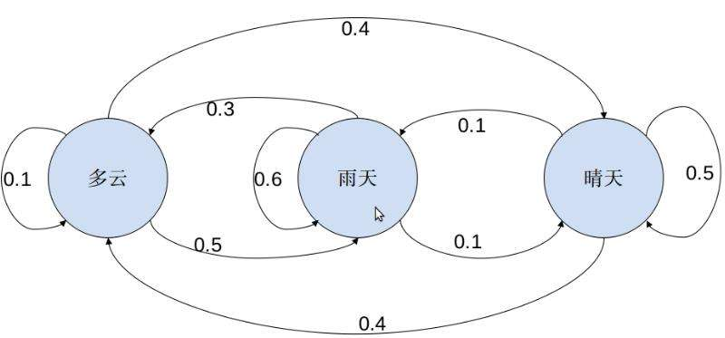

# 马尔可夫链模型

#### 介绍

安德雷·安德耶维齐·马尔可夫 (Андрей Андреевич Марков) (1856年6月14日－1922年7月20日)，俄国数学家。出生于梁赞州，他的父亲是一位中级官员，后来举家迁往圣彼得堡。1874年马尔可夫入圣彼得堡大学，师从切比雪夫，毕业后留校任教，任圣彼得堡大学教授（1893-1905），研究数论和概率论。后自愿承担罪名而被流放到扎拉斯克。1886年当选为圣彼得堡科学院院士。马尔可夫1922年逝世于圣彼得堡。他的同名儿子A·A·小马尔可夫也是一位著名数学家。

Andrea Andervizi Markov (Андрей Андреевич Марков) (June 14, 1856 to July 20, 1922), Russian mathematician. Born in Liangzanzhou, his father was a middle-level official. Later, his family moved to St. Petersburg. In 1874, Markov joined the University of St. Petersburg, studied under Chebyshev, stayed in the university to teach after graduation, and served as a professor of St. Petersburg University (1893-1905), studying number theory and probability theory. Later, he voluntarily assumed the charge and was exiled to Zalask. In 1886, he was elected as an academician of the St. Petersburg Academy of Sciences. Markov died in St. Petersburg in 1922. His son of the same name, A. A. Markov Jr., was also a famous mathematician.

他因提出马尔可夫链的概念而享有盛名，这是说在一系列事件中，某一给定事件发生的概率只取决于以前刚刚发生的那一事件。这一概念发现后已在物理学、生物学和语言学获得广泛的应用。

He is famous for putting forward the concept of Markov chain, which means that in a series of events, the probability of a given event depends only on the event that just happened before. This concept has been widely used in physics, biology and linguistics since its discovery.

#### 模型应用

##### 马尔可夫链在天气预测中的应用：

* 原理图 (Schematic diagram) :

* 脚本文件 (Script file) :

  Markov_Weather_Forecast_Model.py

#### 使用说明

* 打开相应的代码脚本文件直接运行即可。
* Open the corresponding code script file and run it directly.

* 更改代码数值来观察变化，用以学习。
* Change the code value to observe the change for learning.

#### 参与贡献

1.  Fork 本仓库
2.  新建 Feat_xxx 分支
3.  提交代码
4.  新建 Pull Request
